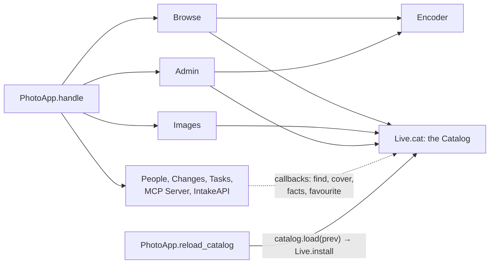
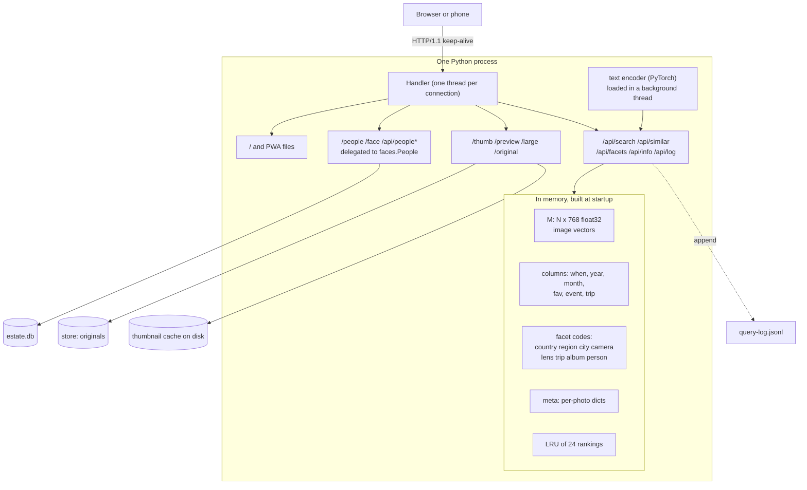
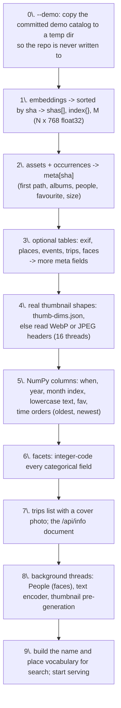
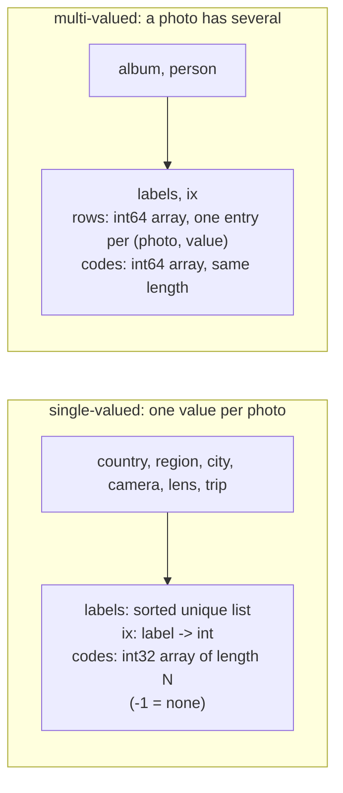
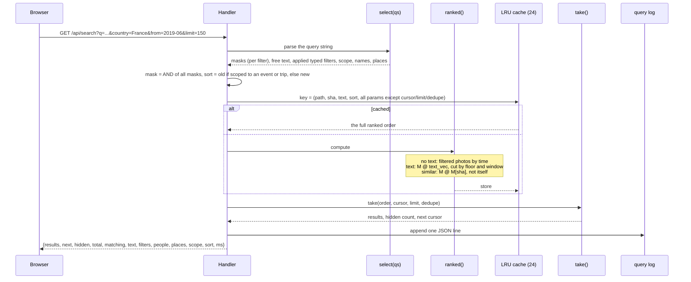
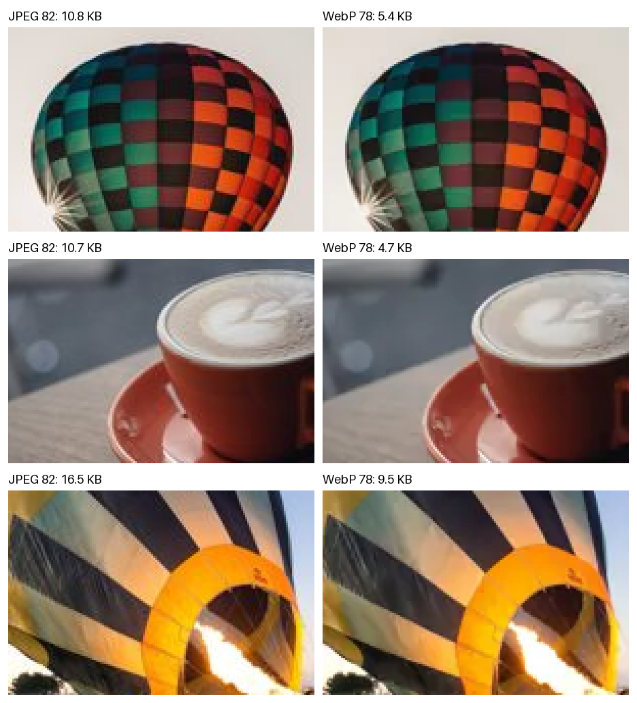
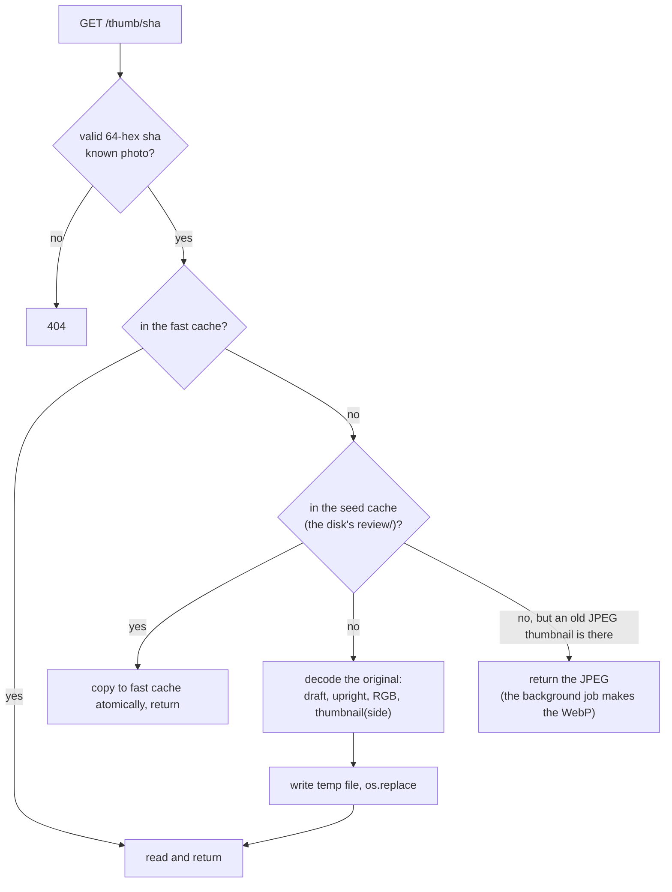

# 11. The photo server

`embed.py serve` is the product: a local web server that holds your whole library in memory and
answers every search, filter and thumbnail request in milliseconds. `PhotoApp` in `photo_app.py` sets
it up and sends each request on (`cmd_serve` in `embed.py` builds one and serves it); the work is done
by a handful of modules that all answer from one in-memory catalog of NumPy arrays. This chapter takes
it apart: how the code is laid out, what it loads, how it is laid out in memory, how a request becomes
a response, and the engineering that makes it feel instant even when the photos live on a USB hard
disk.

```bash
uv run embed.py --db estate.db serve --store STORE      # http://127.0.0.1:8766/
uv run embed.py serve --demo                            # http://127.0.0.1:8767/
```

## How the code is laid out

`cmd_serve` began as one function holding the whole app as closures over the arrays it loaded, and
grew to about 1,640 lines that way. It is now split the way the later features (change sets, the
People page, tasks, `/mcp`, `/setup`) were added from the start: **a module per area, each with an
object whose `handle(method, path, qs, body, ...)` answers its own routes**, returning `(status, body,
content type, Cache-Control[, headers])` or `None` when the path is not its own. `PhotoApp.handle` in
[photo_app.py](../../photo-estate/photo_app.py) tries them in turn and returns what comes back as an
`http_util.Response`, which the HTTP handler writes out.

| Module | Object | Answers |
|---|---|---|
| [catalog.py](../../photo-estate/catalog.py) | `load()` → `Catalog`; `Live`, `Gate` | No routes: the library in memory (everything below), and the catalog being served |
| [browse.py](../../photo-estate/browse.py) | `Browse` | `/api/search`, `/api/similar`, `/api/facets`, `/api/periods`, `/api/layout`, `/api/log`; and an agent's searches (`find`, `row`, `faces`, `overview`) for `/mcp` |
| [images.py](../../photo-estate/images.py) | `Images` | `/thumb/`, `/preview/`, `/large/`, `/original/`; thumbnail pre-generation; which file `/video/` sends (`video_file`) |
| [admin.py](../../photo-estate/admin.py) | `Admin` | `/api/upload/...`, `/api/ingest`, `/api/restart`, `/stats`, `/api/stats`; preparing photos that arrive from the phone; backups |
| [encoder.py](../../photo-estate/encoder.py) | `Encoder` | No routes: SigLIP's text side (and image side, for uploads), loaded in the background |
| [faces.py](../../photo-estate/faces.py) | `People` | `/people`, `/face/`, `/api/people*` ([chapter 14](14-faces.md)) |
| [changes.py](../../photo-estate/changes.py), [tasks.py](../../photo-estate/tasks.py) | `Changes`, `Tasks` | `/changes`, `/api/changes*`, `/api/albums*`, `/api/tasks*` |
| [estate_mcp.py](../../photo-estate/estate_mcp.py) | `Server` | `/mcp` |
| [intake/api.py](../../photo-estate/intake/api.py) | `IntakeAPI` | `/setup`, `/api/intake*` |
| [members.py](../../photo-estate/members.py) | (functions) | Who the estate knows: members, their logins, roles and upload policies, and the journal entries each change appends; `PhotoApp` answers `/request-access`, `/api/request-access`, `/api/me`, `/members` and `/api/members*` with it (below) |
| [journal.py](../../photo-estate/journal.py) | (functions) | No routes: `append` one entry to the journal in the caller's transaction, `since` to read it ([below](#the-journal)) |
| [member_inbox.py](../../photo-estate/member_inbox.py) | (functions) | Each member's inbox: `put` and `close`, called by the code that makes and decides each item; `PhotoApp` answers `/inbox`, `/api/inbox` and `/api/inbox/<id>/dismiss` with it ([below](#the-inbox)) |
| [compare.py](../../photo-estate/compare.py) | `Compare` | `/compare`, `/api/compare*`, only with `--compare-vectors`: a second model's ranking beside the app's own ([chapter 10](10-embeddings.md)) |

What ties the modules together is `PhotoApp` (photo_app.py, about 500 lines): setting up the demo, the
page and the home-screen app files, `/api/info`, `/api/sync`, favourites, album downloads, who a
request is for and what it may do, the members' routes, and re-reading the catalog after an ingest or a change set. `cmd_serve` in embed.py is now
four lines: find the library (or serve the setup page), build a `PhotoApp`, `start()` it, `serve()` it.

**The app is an object you can call.** Building a `PhotoApp` reads the catalog and starts no thread;
`start()` begins the background work (the search model, faces, the sync feed, thumbnails, the inbox
sweep, backups). `PhotoApp.handle(Request) -> Response` answers one request in process, so a test
builds a `PhotoApp` on the demo library and calls it directly, with no subprocess and no PyTorch
([tests/test_photo_app.py](../../photo-estate/tests/test_photo_app.py)); `make_server(host, 0)` puts the
real HTTP layer in front of it on a free port. The HTTP layer (`make_handler`) only reads the request,
with a bounded body, and writes the `Response`: the 304 for a matching `ETag`, gzip, the headers. Three
routes stream and stay in it: phone uploads (into the inbox as they arrive), album downloads (a
zip written as it is read) and videos (`/video/`, read from the disk as they are sent; below). A `Response` is a frozen dataclass (`status, body, content_type, cache,
headers`); the extra headers it carries (`Retry-After`, `Content-Disposition`, `ETag`) replaced the
handler's old mutable `extra_headers`.

### Members, and who may do what

The family can use the estate, each person as a **member** ([members.py](../../photo-estate/members.py);
the design is [notes/MULTIPLAYER-PLAN.md](../notes/MULTIPLAYER-PLAN.md), and this is its phase 1). Photo
Estate never handles a password: identity comes from the tailnet. The app listens on `127.0.0.1` only, so
a request reaches it either through `tailscale serve`, which adds `Tailscale-User-Login` (the login the
person signed in to Tailscale with), or from a program on the Mac itself: the browser there, the
headless agent that works on tasks (tasks.py), an MCP client such as Claude Code. A request is **local**
when it comes from `127.0.0.1` or `::1` with none of a proxy's headers (`Tailscale-User-Login`,
`X-Forwarded-For`, `Forwarded`: `is_local` in intake/server.py).

The catalog keeps its own table of members, and the logins that are them (`members`, `member_logins`,
in core/schema.py's `members` area): the provider proves who someone is, the estate decides what they
may do. A member has a **role** (`sysadmin` or `member`; more than one member may be a sysadmin), a
**status** (`pending`, `active` or `revoked`: a member is never deleted), an **upload policy** that the
iPhone app reads from `GET /api/me` (`everything`, `review`, `review_flagged`: the phone gate,
[chapter 24](24-uploading.md#the-phone-gate-looking-before-sharing)), and may be linked to a
person in People. A member is not a `persons` row: those are the people *in* the photos. Triggers refuse
deleting a member or a login ([chapter 5](05-catalog.md#protected-tables)).

`PhotoApp.who(headers, local)` says which member a request is for, from a copy of the members kept in
memory (they change only through the app, which reads them again after each change). A local request
is the sysadmin. Each request then takes one of the rules in `ROUTE_AUTH` (photo_app.py), checked
before it reaches its module (`http_util.Auth`):

- **`MEMBER`**, the default: an active member, whatever their role, or a local request. Every page, every
  read and every write that is not below: searching, images and videos, the sync feed, People,
  favourites, albums and change sets, tasks, `/mcp`, the ingest, uploads.
- **`SYSADMIN`**: an active sysadmin, or a local request. `/members` and its API (letting people in),
  `/setup` and `/api/intake/...` (a job reads any folder on this computer), restarting, and the machine's
  figures: `/stats`, `/api/stats` and `GET /api/ingest` (they count every member's photos, private ones too,
  and the ingest's log names files; phase 5).
- **`PUBLIC`**: only what a browser needs to ask to be let in: `/request-access` and `POST
  /api/request-access`, the home-screen app's files (manifest, icons, the service worker), and
  `/api/info`, which tells someone who is not a member only `{"member": false}` (that the app is up:
  the setup page waits on it), and a member the library's numbers.
- **`LOCAL`**: this computer only; no route needs it yet.

A refused browser opening a page is shown the **request-access page** with a 403: for a login nobody has
let in, "Ask John to let you in" (the first active sysadmin's name), a name field and a button, which
makes a `pending` member and puts the request in every sysadmin's inbox ([below](#the-inbox)); after that,
that John has been told and will let them in; for a revoked member, that they are not let in. It is a page of a few words with no script, so it needs nothing that is not open. Anything
else refused is `403 {"error": "not allowed"}`. The album download and `/video/` stream past `route()`
in the HTTP handler, which asks `PhotoApp.refusal` first; an upload checks the same rule in admin.py.

The sysadmin lets people in on **`/members`** (members.html, its state machine in
`app/members-flow.js`): who has asked, who is in and who is turned off, each with their logins; let in,
turn away, turn off, let in again; a role, an upload policy, a name, and the person in People they are.
The estate always keeps an active sysadmin: a change that would leave none is refused. `GET /api/me`
says who a request is for. A task records who asked for it (`agent_tasks.acting_for`), from the
Changes page and from `/mcp`'s `submit_task`; the agent calls `/mcp` from this computer with its run's
token, and is answered as that member sees the library (below, [What each member
sees](#what-each-member-sees-lenses), and [the estate's agent](#the-estates-agent-listeners-questions-and-stories)).

**The first start.** A catalog made before members has none. On the first start of the new code, the
logins given by `--upload-user` become active members who may upload everything, the first of them the
sysadmin (or the one `--sysadmin` names). After that the options are not read again: members are kept on
`/members`. With no `--upload-user` and no members, only this computer can use the app until a sysadmin
is let in from it. Existing `created_by` and `set_by` values are logins, so they already name these
members; they are not rewritten.

Until 2026-11-22 the rule was different: reading was open to anyone who could reach the app, and every
write took a `--upload-user` login (anyone, when none was named) or a local request. Before 2026-11-19
the People page's writes took no permission at all, and intake, the ingest, restart and uploads took a
`--upload-user` login but refused this Mac's own browser and agent.

### The journal

Every write the app makes appends one entry to the **journal**, the estate's append-only log, in the
same transaction as the change it records ([journal.py](../../photo-estate/journal.py):
`append(con, actor, kind, subject, data, acting_for)`, and `since(con, id)` for the listeners of a later
phase; nothing reads it yet). An entry is who did it (`actor`, the member the request was for: `who()`
above, so a request from the Mac itself is the sysadmin), its `kind`, what it is about (`subject`:
`album:12`, `member:3`, `task:5`, a sha) and a little JSON. It is one entry per action, never one per
photo: applying a set that hides ten thousand photos is one `album.applied` naming the set, with counts.
A write that changes nothing appends nothing. The kinds, listed in journal.py's docstring: `member.*`;
`album.created`, `.items`, `.decided`, `.applied`, `.reverted`, `.committed`, `.reopened`, `.hidden`,
`.viewed`, `.renamed`, `.query`, `.discarded` (changes.py, for albums and change sets alike);
`favorite.set`; `faces.labeled` and `person.changed` (People, beside its own `face-labels.jsonl`, which
stays as it was); `task.submitted` and `task.finished`; `ingest.finished`, `photo.purged` and
`sharers.migrated` (estate.py). The state tables stay the truth for what the app shows; the journal is
the history beside them, and triggers refuse any `UPDATE` or `DELETE` of it.

The actor reaches each write as a member id beside the login the code already passed: `PhotoApp`
gives `m.id` to `Changes.handle`, `Tasks.handle`, `People.handle`, `set_favorites` and `/mcp` (whose
tools that write pass it on). A task's agent is no member yet, so what it does is journaled with no actor,
acting for the member who submitted the task (`acting_for`; its change sets still carry `created_by`
`task:<id>`), as is a run's own end, `task.finished`. Phase 3 added the lens kinds: `lens.created`,
`lens.subscribed`, `lens.unsubscribed`, `lens.published`/`unpublished`, `lens.proposed`,
`lens.accepted`/`declined`, `album.published`/`unpublished`, `photo.shown`/`unshown` and
`lenses.migrated`; `album.applied` names the lens a set hides for. Phase 4 added `inbox.dismissed`
(below): an inbox item made or closed is not journaled, because the entry of what made or decided it is.

### What each member sees: lenses

One member's hidden photos are not everyone's (phase 3 of the plan). What a member sees is worked out
from a handful of state tables ([lenses.py](../../photo-estate/lenses.py), in core/schema.py's `lenses`
area), and asked of **one function**, `Live.visible_for(member)` (catalog.py): every route that answers
from the catalog (search, similar, facets, Years and Months, the layout, `/api/info`, the sync feed,
albums, People's lists, `/stats`, `/compare`, the MCP tools) reads the **member view** it returns, never a
mask of its own. A test reads the code to keep it so (tests/test_multiplayer.py,
`test_no_route_reads_a_mask_but_through_visible_for`): the `Catalog` has no `visible`, `fav`, stacks,
trip cards or `info` any more, so a route that reached for them would fail, and the test also refuses
reading the `hidden` table, or a photo's facts for a favourite, outside the modules that own them.

- **A lens** is a named view, a row of `lenses`, its owner's, private until published. A **filter** leaves
  photos out: its photos are what the hiding change sets that name it hide (`change_sets.lens_id`;
  `hidden(sha256, set_id)` is as it was), each reviewed batch its own set, applied and reverted on its own.
  A **series** is an album (`lenses.set_id`), given its lens when its owner first publishes it.
- **Which filters are on** for member M (`State.on`): M's own; every **estate default** (a published filter
  every member sees through) unless M has opted out (`subscriptions.mode` `opted_out`, or `snapshot`); and
  any other published filter M subscribes to `live`. A filter is always on, everywhere; the filters add
  their hides together. A series is never on: subscribing to one puts it in M's Albums and changes
  nothing else.
- **What M sees**: what M may be shown (`shared_for`: every photo but those private to their sharers when M
  is not one of them, [below](#private-photos)), less what M's filters hide, less nothing M has said to
  **show anyway** (`shown`). A hiding set with no lens
  (from before lenses) hides for everyone, as all hiding did before.
- **A snapshot** subscription copies what the lens holds now into one of M's own (a filter: a new filter
  lens of M's with one applied set; a series: a new album of M's with the photos M sees of it); it does
  not follow later changes. A live subscription does, at once.
- **Applying** a hiding set hides for a lens chosen at its first apply: the owner's own filter by default
  (titled plainly "Hidden photos", made then), or the Estate defaults, for a sysadmin who asks (`{lens: "estate"}`).
  A set that hides something keeps its lens until it is reverted.
- **Proposing** a filter as an estate default publishes it and marks it (`lenses.proposed_at`); a
  sysadmin accepts (it becomes one) or declines. Every other sysadmin is told in their inbox ([below](#the-inbox)).
- **Favourites** are each member's own (`member_favorites`; the old `favorites` table is no longer
  written). What a photo's source said (`assets.favorited`) is a favourite of its sharers only.

**The member view** (`catalog.View`) is not a bare mask, because the catalog worked visibility into more
than one thing: the mask; which photo of a stack is on top and how many it holds (stacks are grouped over
the photos the member sees, so a stack whose best shot one member hid shows them its next best, while
everyone else still sees the best); the trip cards and their covers; the counts in `info`; and the
favourites. `Catalog.view` works all of it out in a few NumPy passes; `Live` keeps one per member until
the catalog is replaced (`install`) or someone's hides change (`relook`, which reads the tables again:
`lenses.read`), and a favourite is shown in the member's own view in place. `Browse.remember` has the
member in its key. A row's `fav` is filled from the member's view as the row is sent (`View.row`,
`View.feed_row`): a photo's facts (`Catalog.meta`) no longer carry one.

The lens routes (`/api/lenses...`, `/api/albums/<id>/publish`, `/api/photos/<sha>/show`) are answered
outside the gate, like a favourite: the change is in every view (`relook`, on the gate's write side)
before the answer goes back, and the feeds and People follow in the background. An apply on the review
page is taken in in the background as before (`busy` until it is). **Why** a member does not see a photo
is `GET /api/photos/<sha>/why`, read from the state tables (the hidden rows, their sets, the sets' lenses
and the lenses' owners), never the journal: "Hidden by Ada's lens “Estate defaults” on Nov 3" (`text`; the
year only when it is not this one), "Hidden by your lens “Hidden photos” on Nov 23"; `reasons` carries the
same, structured, for a page to word itself. The pages that use all of this are [chapter 26](26-albums-and-agents.md#lenses-on-the-pages).

**Albums** are their owner's (`change_sets.owner`): a member lists and opens their own and the series
others publish, and only the owner changes one. Inside any album or series, whoever made it, the photos are
listed through the viewer's own view: a series never shows a member what their filters hide. A set up for
hiding is its owner's review of what it hides, so it lists every photo of it (marked `hidden`).

**People** stays built once, for everyone ([chapter 14](14-faces.md)): its faces leave out the photos the
estate defaults hide and every photo private to anyone (`faces.default_hidden`), not any member's own hides. A member's own filters apply as
faces are listed: a person's faces, the review queue, the unnamed groups and a person's cover leave out
faces in photos the member does not see (`People.handle`'s `keep`); the counts stay People's own.

**The agent answers for a member.** The MCP tools read the view of the login that called, and for a
task, of the member it was submitted by (`agent_tasks.acting_for`, fixed by its run's token since phase 7): a
task Ben submits searches as Ben, and the albums and change sets it makes are Ben's.

**The sync feed** is one per member ([chapter 20](20-sync.md)).

**Before `estate.py migrate`** (a catalog the phase-3 code opens before the migration has run, which is
the Mac mini between the deploy and the migration): a hiding set with no lens hides for everyone; an album
or set with no owner, a photo with no sharer, and a row of the old `favorites` table are the first
sysadmin's. So the owner sees exactly what he saw before, and so does every member, with nothing to opt
out of until the migration names the Estate defaults. The migration ([appendix A](appendix-a-commands.md))
gives those sets the lens Estate defaults, those albums the sysadmin, and copies the old favourites to
the sysadmin's own.

### The inbox

Every "propose" in the design ends with someone deciding, so each member has an **inbox**: what waits for
them ([member_inbox.py](../../photo-estate/member_inbox.py), the table `inbox_items` in core/schema.py's
`members` area; phase 4 of the plan). The word "inbox" is also the upload folder (`--inbox`), which this
has nothing to do with: hence the module's and the table's names. An item is a member, a **kind**, a
**ref** (what it is about, in the journal's words: `member:4`, `album:12`, `lens:3`), a title, and a state:
`open`, `done` (decided, or no longer anyone's to decide) or `dismissed` (put away by its member).

An item is made **by the code that needs the decision**, in the same transaction as what caused it, and
closed by the decision itself wherever it is made. The inbox decides nothing: each kind opens the screen
that already decides it.

| Kind | For | Made by | Closed by | Opens |
|---|---|---|---|---|
| `member_request` | every active sysadmin | `members.request`: someone asked to be let in | letting them in or turning them away (`members.change`, from `/members`) | `/members` |
| `review` | whom the task acted for | `Tasks.move`, when a task ends (done, failed or cancelled, and a run the app restarted under): each hiding set its agent made that has photos and hides none yet | applying the set in full, taking it down to an album, or discarding it (changes.py) | `/changes/<id>` |
| `lens_proposed` | every other active sysadmin | `lenses.propose` | `lenses.decide` (accept or decline), or the owner taking the filter back (unpublishing) | the Albums tab, where "Waiting for you to decide" lists it |
| `lens_changed` | each member subscribed to a published lens live (not its owner, nor whoever changed it) | changes.py, when a filter's hides change (an apply, a revert, a hidden photo taken out of a set) or a series' photos or search do | nothing waits on it: leaving the lens (unsubscribing, or keeping a copy instead) closes it; otherwise it is put away | the Albums tab (a filter), or the series |

| `held` | the photos' sharer | private.py, when the hold at ingestion (or the one-off run over the library) keeps photos private to them: one per batch, `held:<batch>` | nothing it held is still held (released by hand, in a batch, or on its day) | the held view, `/?q=is:held` |

`lens_changed` is one open item per member and lens, brought up to date ("Ben's lens “Hidden photos”
changed: it hides 4 photos now") and moved to the top, never one per change; the change itself applies at
once. An estate default has no subscription rows (every member is in it unless they opt out), so it tells
nobody: the sysadmin's everyday hiding would otherwise reach every member's inbox. The `review` trigger is
the end of the task rather than the set being made, because an agent fills a set over many calls and a
set looked at half-made would be reviewed again.

`GET /api/inbox` is the member's open items, newest first, each with what it `opens`, and how many;
`POST /api/inbox/<id>/dismiss` puts one away (`404` for any item that is not the member's own, `409` for one
that is not open), journaled as `inbox.dismissed`, the one thing about an item that no other entry says.
The page is **`/inbox`** ([chapter 26](26-albums-and-agents.md#the-inbox)); the Library's menu shows how many
items are open. A later phase adds a kind with a row in `member_inbox.OPENS` (what its item opens) and a
`put` and a `close` in the code that makes and decides it.

### Private photos

A photo can be **private to its sharer** (phase 5 of the plan; [private.py](../../photo-estate/private.py)). A
**sharer** is a member who shared a photo: ingest records it in `sharers` ([chapter 4](04-store-and-ingest.md)),
from the folder a phone's upload lands in (`<inbox>/m<member id>/YYYY/MM/DD/...`; admin.py chooses it from the
member the request is for, and the phone's path is unchanged), and anything else (a bulk import from the setup
page, a Takeout, an upload from before member folders) is the first sysadmin's. A copy a second member sends
adds a sharer; it is not a new photo. A photo is private to a sharer while a row of `private` names them and is
not released (`released_at`); its `why` is how it got there:

- **`new`**: a phone upload not checked yet. Ingest writes the row in the transaction that adds the photo, for
  an image nobody else is shown yet (a new photo, or one every sharer holds private).
- **`held`**: the check found it looks like a receipt, a screenshot or a document, and kept it private.
- **`withdrawn`**: its sharer took it back from the family, from the viewer.

**Who may be shown it** (`lenses.State.shared`, from `private.Private`): everyone, unless every one of its
sharers holds it private; then those sharers only. So a photo Ben and Cleo both shared, withdrawn by Ben, is
still shown to everyone (Cleo shares it); withdrawn by both, to the two of them. A photo with no sharer row is
the first sysadmin's. The estate's agent acting for nobody (a task with no `acting_for`) reads as member 0,
`NOBODY`, and is shown only photos private to nobody. That one mask is `Live.shared_for`, and so everything
goes by it: every view (`visible_for` builds on it), the counts, facets, trips, Years and Months, covers and
"similar" neighbours of each view, `hidden=1`, the sync feeds, the MCP tools, albums, series and their zip,
change sets' review pages, and every pixel route. A photo private to someone else **does not exist** for a
member: every route that takes a sha answers it exactly as one the library does not have (`/thumb/`,
`/preview/`, `/large/`, `/original/`, `/video/`: 404 with an empty body; `/api/photos/<sha>/why`: 404 "no such
photo", never "it is private"; `/api/similar`: "unknown photo"; a stack named by it; the MCP's `get_photos`,
`similar_photos`), and so does a Live Photo's clip whose stills are all private to others (`Catalog.stills`)
and a face crop of a face in such a photo (`/face/<id>`, People's `see`). An event or trip only private photos
are in has no title for them; a trip's count and dates are of the photos they may be shown; a person or place
only such photos carry is a plain word in a typed search, and a name the MCP's search does not know. A task's
record (its events, its report: what its agent saw, which is what its member sees) is for that member only:
`/api/tasks` lists a member's own tasks, and another's is a 404. `/stats` and `GET /api/ingest` (the machine's
figures, and the inbox's run log, which names files) are the sysadmin's ([below](#members-and-who-may-do-what)):
its library figures are of the photos the first sysadmin may be shown; its disk figures are the machine's own,
every file counted, with no file name of a private photo.

**People** is built without every photo private to anyone, its sharer included, until it is released, as
without what the estate defaults hide; a change to what is private reloads it, as a change to an estate
default does (`PhotoApp.relook` says whether `State.people_out` changed).

**The hold at ingestion.** ingest-iphone.sh runs `private.py check` after the embeddings and before it tells
the app (`catalog_ready`): each `new` row whose photo has a vector is scored against three prompts ("a
receipt", "a screenshot of a phone", "a document": `private.PROMPTS`) with its SigLIP 2 vector, plus
`catalog.is_screenshot` and the phone's own mark (an upload's `X-Screenshot`, which upload.py writes into its
sidecar as the keyword `screenshot`, read back from the `xmp` table); one at or over `private.HOLD_AT` (0.095) on
any prompt, or a screenshot, is **held**
(one `photo.held` journal entry and one `held` inbox item per member and batch), and the rest are let go (their
row goes: the photo is shared). The prompts' vectors are a file (`hold-prompts.json`, made once by `embed.py
hold-prompts`), so the check never loads the model and works whether the app runs or not; without them it
stops, and the photos stay private. **Why no one else can see a new upload before it is scored**: the
`new` row is written in the same transaction as the photo's `assets` row, and a photo is in a catalog only once
it has an `assets` row and a vector. The app reads who is private after it reads a catalog and inside the swap
that installs it (`PhotoApp.with_private`, `Live.install(looks=...)`), and at startup after the catalog too,
so every photo a catalog holds has its row in the looks it is seen through, whichever reload (the ingest's,
a setup job's, a restart) comes when. A photo with no vector is in no view at all (`catalog.load` reads only
photos with one), so a failed embed leaves it unseen and its row waiting for the next check. What is held: phone
uploads of every member, the owner's too; not bulk imports, and not a photo the family is already shown.

**Withdraw and release.** `POST /api/private {shas | which: "held" | "private", private: true | false, until?}`:
a sharer withdraws photos (private, `withdrawn`), sets the day one is released on by itself (`until`,
`YYYY-MM-DD`, the computer's own date), or releases them now; `which` releases a whole held view at once. A
photo the member may not be shown is a 404, one they did not share a 403. It is answered outside the gate,
like a lens: every view is worked out again (`relook`) before the answer, and the feeds and People follow.
A timer in the app (`PhotoApp.release_timer`, a thread `start()` starts beside the others) asks every minute
whether a day has come (`private.release_due`): those photos are released, journaled by no actor acting for
their sharer. A release closes every `held` item of the member's whose photos are all released. A released row
stays (`released_at`), so the one-off run never holds again what its sharer let go. `GET
/api/photos/<sha>/why` carries `private`: whether the member shared the photo, whether it is private to them
(why, since, until), and how many other sharers still share it. Search's `is:private`, `is:held` and
`is:withdrawn` find the member's own; a row of theirs says `private` ([chapter 26](26-albums-and-agents.md#private-photos-on-the-pages)).

**Tombstones: what a member keeps off the estate** (phase 6, the phone gate; [chapter 24](24-uploading.md#the-phone-gate-looking-before-sharing)).
A photo a member opted out of on their phone is a row of `tombstones` with their member id and the SHA-256 of the
file (`why` `opted_out`); a purge's is member 0's ([chapter 4](04-store-and-ingest.md)). `GET /api/tombstones`
gives the member their own, not lifted (hashes only: a new phone reads them before it sends anything); `POST
/api/tombstones {add?, lift?}` opts out of hashes or takes opt-outs back (`lifted_at`; opting out again clears
it), the member's own only, one `tombstones.changed {opted_out, lifted}` journal entry a call
(`private.change_tombstones`). An upload is refused when its bytes are tombstoned for the member sending them, or
purged (`private.refused_upload`): with `X-Content-SHA256` before the body is read, without it once the bytes are
in and hashed, from the staging file, so nothing reaches the inbox, the store, the catalog or a backup. The answer
is a `200` with `X-Upload-Refused` ([chapter 24](24-uploading.md) says why). An opt-out refuses only that
member's copy, and is no withdraw: a photo already in the estate, or shared by someone else, is untouched.

**The one-off run over the library** (the plan's open question 3: nobody else is let in until it has run, as
the owner's, and he has looked over what it held): `private.py library --member <id>` scores every image the
member shared (for the first sysadmin, every image with no sharer too) the same way and holds what crosses as
theirs: one `photo.held` entry with the count, one inbox item. With `--dry-run` it changes nothing and prints,
with no pixels and no file names, how many each prompt would hold, the best scores near the threshold, and a
sample of ids. It is safe to run twice, and never holds a photo the member released ([appendix A](appendix-a-commands.md)).

### The estate's agent, listeners, questions and stories

*(Multiplayer phase 7, the server half: tasks.py, estate_mcp.py, listeners.py, stories.py, transcribe.py.)*

**The estate's agent is a member**: kind `agent`, made the first time anything needs it (`members.agent`; the
app makes it at start, before it reads who sees what), never deleted, with no login. A run of it gets a
capability, not a task number: `Tasks.run` mints a random token (`secrets.token_urlsafe(32)`) for *this agent,
acting for this member (or no one), for this task*, puts it in the agent's MCP config as `X-Estate-Agent`, and
forgets it in the run's `finally`. Tokens are held in the app's memory only (`Tasks.runs`), never written down,
so a restart ends them all, and the run that was going is marked failed by `Tasks()` as before. `/mcp` honours a
token only from this computer (`is_local`) and only while its run lasts; one from elsewhere, one that is no
running task's, or a request still carrying `X-Estate-Task` (the task number runs carried before) is refused
`403`, never answered as this computer's sysadmin. A run's writes are journaled with the agent as the actor and
its member as `acting_for`. Acting for a member, it sees what they see (`visible_for(acting_for)`) and writes
their albums and change sets; acting for no one it is **the family archivist**, which reads as itself, and an
agent is shown what `NOBODY` is (`private.Private.agents`): only photos private to nobody, with the estate
defaults applied. An album the archivist makes is published at once as a series it keeps
(`lenses.maintained_by`). No tool applies anything.

**Every run is recorded**, the ones a listener starts too: an `agent_tasks` row with `started_by`
(`member:<id>` for a person; `journal:<entry>/album:<id>` or `journal:<entry>/story:<id>` for a listener).
Any member may start a run (open question 4), for themselves, or with `family: true` for the archivist. A
person's request to hide photos gets the old brief (`BRIEF`); a family request or a listener's run gets
`WORK_BRIEF`.

**Listeners** (listeners.py) read the journal, each from its own cursor (`listener_cursors`), in one thread of
the app (every 30 seconds, and at once after a reload or a story). A rule decides first, from the tables; only a
yes wakes the model. Delivery is at least once: the cursor moves past an entry once its handler is done, and each
handler looks for what it would make before making it. A listener new to a catalog starts at the journal's end.

- **Series.** A series, in the data, is a list album with a search it grows from (`change_sets.grows_from`):
  chosen photos, added to and never worked out again, so what its owner took out stays out. A live album is
  not one: it is its search, and holds new photos as soon as they are in the catalog. On `ingest.finished`
  (whose data now says which rowids the run added), the series listener waits until the catalog being served
  was read after the entry, then runs each series' search as its owner over the whole library, as the app
  ranks it (a search's floor is relative to its best match, so it cannot be run over the new photos alone),
  and keeps the new photos it finds that the album does not hold. For a family series a run of the archivist
  looks at them and adds those that belong; for a member's own, a `series.update_requested` entry names them
  and a `series_update` item waits in the owner's inbox (`GET`/`POST /api/albums/<id>/candidates`).
- **Stories.** On `story.told` (with text) or `story.transcribed`: if the story answers a question the
  estate's agent asked with `follow_up`, and the member that run acted for may read it, a new run acting for
  them gets the question, the answer and the photos.

**Questions** (stories.py; the MCP tool `ask_member`) may name only photos the asker sees and the recipient may
be shown, and for the whole family only photos private to nobody: anything else is refused, never trimmed.
They are queued; **the inbox decides how many a member sees**, when it is read: at most `ALLOWANCE` (3) new items
in any 7 days, or the member's `members.questions_per_week`, and none while that many are open. A `group_key` is
one item ("3 questions about Thanksgiving 1998"), which a later question of the group joins for nothing. Groups
are dealt naming a photo nobody has told a story about first, then a photo of a series, then by the asker's
priority, then oldest first. "I don't know" (dismissing a question, or its item) puts it away for that member
for good; it counts against the week it was dealt in and nothing after. A question naming a photo the member may
not be shown now waits, and one already dealt is left out of their inbox, item and all.

**Stories** are what a member said, attributed and dated: typed, or a recording uploaded as the body of the
request (an iPhone's AAC `.m4a`, a browser's `audio/mp4` or `audio/webm`, `.wav`, up to 8 MiB), stored in the
store content-addressed with `estate.store_blob` (immutable in a marked store) and **no `assets` row**, so it is
in no photo view; with `--demo`, beside the scratch catalog, never in the checked-in store. A story is read by its
teller and by whoever may be shown every one of its photos (a story naming one photo private to its teller is
theirs alone), and its recording by the same rule. `stories` and `story_photos` are protected like the other
append-only tables: no delete, no replacing insert, no update but the transcript, written once. `estate.py purge`
takes the purged photo out of the stories about it (it drops `story_photos_no_delete` in its transaction, as the
others) and keeps the stories: one about that photo alone is then its teller's only.

**Transcription** is a queued job (`transcribe.Job`), run when a recording is uploaded and at start:
`uv run transcribe.py run`, a uv script with its own environment, NVIDIA Parakeet TDT 0.6B v2 through
`parakeet-mlx`. Its own audio loader calls a system `ffmpeg`, which the mini does not have on the app's PATH, so
transcribe.py decodes with PyAV (16 kHz mono) and hands the samples to the model. The model is fetched by hand
(`transcribe.py fetch`, deploy/MAC-MINI.md), never by a request: the app runs with `HF_HUB_OFFLINE=1`. Without
it, each waiting story says how to fetch it (`transcript_error`), and a job that cannot run at all (no MLX: not a
Mac) says so on each; both are tried again on the next run. It need not be real time.

### A member's own agent

*(Multiplayer phase 8: members.py's bindings, estate_mcp.py, journal.py's `for_member`, agents.html.)*

A member brings their own agent: Claude Code (or another harness) on their own computer, on their own account,
calling `/mcp` through `tailscale serve`. **A call on `/mcp` with a member's login is that member's agent**, never
the member themselves; a call from this computer with no login, and a run of the estate's agent with its token,
are as before. It is not a member row of its own: it is that member's agent *on one device*, an `agent_bindings`
row (`members.bind`), and the device is the tailnet node the call came from.

**What a device is.** `tailscale serve` adds the user's identity (`Tailscale-User-Login`, `Tailscale-User-Name`,
`Tailscale-User-Profile-Pic`), and nothing that names the node; it also sets `X-Forwarded-For` to the tailnet
address of the node that sent the request, replacing whatever the client sent. `PhotoApp.device` asks
`tailscale whois --json <address>` (on PATH, or the macOS app's own CLI) for the node's `StableID` and name, kept
ten minutes per address; when whois cannot say, the address is the device. With `--demo`, `X-Demo-Device` names
it (the demo's stand-in, like `X-Demo-Member`), and a call with no forwarded address is "this computer".

**The binding's states.** The first call from a device makes it `pending`, with a `binding.requested` entry and a
`binding` item in the member's inbox ("An agent connected as you from alice-macbook. Allow it?"), once, not once a
call. Pending, it may call every tool that only looks; every tool that writes answers that the member must allow
it first, in their inbox, from another device. `approved`, it writes as the member: the journal names the member as
the actor, and every entry it makes carries `{"binding": <id>}` in its data (`journal.by_agent`, around each tool
call), which says "by Alice's agent on alice-macbook". `revoked`, every call is refused (403), reads too: turning it
off means it no longer acts as the member at all. Only the member moves it, on the web (`POST /api/agents/<id>`),
never through `/mcp`: pending → approved or revoked, approved → revoked, revoked → approved. **Allowing must come
from another device than the agent's own** (403 otherwise): the agent holds the member's login on its device and
could send any request a browser there could, so nothing that comes from that device is proof that the member said
yes. Turning one off is allowed from anywhere. Another member's binding is a 404.

**What it may call.** The estate's agent's tools acting for its member, less `submit_task`, `get_task` and
`cancel_task` (its work runs in the member's harness, never on the owner's subscription; called anyway they answer
so), and `ask_member`'s `follow_up` (which starts a run of the estate's agent). Only it is offered
**`journal_since(cursor, limit)`**: what changed in what its member may know of, oldest first, at most `limit`
(100, up to 500), looking at no more than 5,000 entries a call, with `next_cursor` and `more`. The journal is the
whole estate's history, so `journal.for_member` returns only, by kind: entries about the member's own albums,
lenses, favourites, "show it anyway", private photos, questions, inbox and agents; another member's album only while
it is a published series (created, items, renamed, query, grows, published, with no data); a lens while it is the
member's or published; an ingest with its photos replaced by those the member may be shown (and not before the
served catalog was read after it); a story they may read, with its photos; `series.update_requested` for their own
series, with its photos and whether their item is still open (`waiting`). Never: members, migrations, faces, tasks,
purges, opt-outs. journal.py's docstring is the table, kind by kind. `amend_album`'s `request_done` closes the
member's `series_update` item once their agent has looked at a series' new photos and added what belongs (it is
the `candidates` write with nothing more to add: what was left out stays out).

**Connect your agent** (`/agents`, in the Library's menu) shows the command with the address the page was reached
at (`X-Forwarded-Host` through serve), a configuration for other harnesses, where an agent can run, and the
member's agents with their state, asking again every few seconds while it is open.

### Malformed requests

A request the app can't read is answered, not raised (`http_util.py`): a query parameter that should
be a number and isn't (`limit` and `cursor` on `/api/search`, `limit` on `/api/sync`, `job` and
`after` on `/api/intake`) is `400 {"error": "limit must be a whole number"}`; a POST body that is not
JSON is `400 {"error": "the body is not JSON"}` (on `/mcp`, JSON-RPC's own parse error, also a 400); a
`Content-Length` that is not a number is a 400; and a JSON body over 8 MB (`http_util.MAX_BODY`) is a
413, answered without reading it, and the connection is closed. An empty body is still `{}`. A month
filter (`from=`, `to=`) outside 1-12 is ignored, like any other unreadable date.

**One state object, not closures.** The modules share the in-memory catalog through one object,
`catalog.Live`, whose `cat` is the `Catalog` being served. A `Catalog` is built once by `load()` and
then only read (a favourite set in the app is the one exception: it is shown in place at once). A
route reads `live.cat` once at the start and uses that catalog to the end; the handler holds `Live`'s
`Gate` for every request except slow ones (uploads, setup, album downloads, judged on the path
without its query string, `PhotoApp.gated`), and a reload swaps the new catalog in through the same gate
(`Live.install`), so a search never sees half an old catalog and half a new one. Setting a favourite
changes the catalog being served through the gate's write side too (`Live.update`), so its requests
(`POST /api/favorite`, `POST /api/albums/<id>/favorite`) are let through without the read side. The questions every route asks of the arrays are `Catalog` methods (`combine`,
`facet_counts`, `take`, `periods`, `browse_order`, `cover_of`, `feed_row`, ...).

**Every field typed.** `Catalog` is a slotted dataclass that declares each of its fields with its
type (`M: NDArray[np.float32]`, `meta: dict[str, PhotoMeta]`, `rank: NDArray[np.int64] | None`, ...),
and `load()` builds it by keyword, so pyright checks every attribute a route reads
([chapter 17](17-testing-and-demo.md#type-checks)). Until issue #90 its attributes came from
`__dict__.update` over the names of `load()`'s local variables, which no checker could follow. `best`,
`rank` and `score` are `None` in a catalog with no scorers (the demo has none): a route checks
`c.best is not None`, or calls `c.scored()`, which gives all three or raises `ValueError`. A photo's
dict is a `PhotoMeta` TypedDict: the keys from `assets` and `occurrences` are always there, those
from `exif` and `places` only when their table has a row. `STATE` is now derived from the fields: the
ones `load()` works out, which `differences()` compares after an incremental reload.


```mermaid
flowchart LR
    H["PhotoApp.handle"] --> BR["Browse"]
    H --> IM["Images"]
    H --> AD["Admin"]
    H --> OTH["People, Changes, Tasks,<br/>MCP Server, IntakeAPI"]
    BR & IM & AD --> LIVE["Live.cat: the Catalog"]
    OTH -.->|"callbacks: find, cover,<br/>facts, favourite"| LIVE
    BR --> ENC["Encoder"]
    AD --> ENC
    RL["PhotoApp.reload_catalog"] -->|"catalog.load(prev) → Live.install"| LIVE
```

## The shape of it


```mermaid
flowchart TB
    BR["Browser or phone"] -->|"HTTP/1.1 keep-alive"| H["Handler (one thread per connection)"]
    subgraph proc["One Python process"]
      H --> API["/api/search /api/similar<br/>/api/facets /api/info /api/log"]
      H --> IMG["/thumb /preview /large /original"]
      H --> PEO["/people /face /api/people*<br/>delegated to faces.People"]
      H --> PG["/ and PWA files"]
      subgraph mem["In memory, built at startup"]
        M["M: N x 768 float32<br/>image vectors"]
        COL["columns: when, year, month,<br/>fav, event, trip"]
        FAC["facet codes:<br/>country region city camera<br/>lens trip album person"]
        META["meta: per-photo dicts"]
        LRU["LRU of 24 rankings"]
      end
      API --> mem
      TE["text encoder (PyTorch)<br/>loaded in a background thread"] --> API
    end
    IMG --> CACHE[("thumbnail cache on disk")]
    IMG --> STORE[("store: originals")]
    API -.->|"append"| QL["query-log.jsonl"]
    PEO --> DB[("estate.db")]
```

There is no framework. The handler is a `BaseHTTPRequestHandler` subclass with `do_GET` and
`do_POST`, the server a `ThreadingHTTPServer`. A library for one household does not need more, and a
standard-library server is one less dependency. (PERFORMANCE.md records the one place this costs:
about 80-110 ms of a warm 150-thumbnail burst is the Python server itself; a faster static server for
`/thumb/` was judged not worth it, issue #25.)

## Startup, step by step

Startup does all the expensive work once, so that requests can be cheap. The steps, in order:


```mermaid
flowchart TD
    S0["0\. --demo: copy the committed demo catalog to a temp dir<br/>so the repo is never written to"] --> S1
    S1["1\. embeddings -> sorted by sha -> shas[], index{}, M (N x 768 float32)"] --> S2
    S2["2\. assets + occurrences -> meta[sha]<br/>(first path, albums, people, favourite, size)"] --> S3
    S3["3\. optional tables: exif, places, events, trips, faces<br/>-> more meta fields"] --> S4
    S4["4\. real thumbnail shapes: thumb-dims.json,<br/>else read WebP or JPEG headers (16 threads)"] --> S5
    S5["5\. NumPy columns: when, year, month index, lowercase text, fav,<br/>time orders (oldest, newest)"] --> S6
    S6["6\. facets: integer-code every categorical field"] --> S7
    S7["7\. trips list with a cover photo; the /api/info document"] --> S8
    S8["8\. background threads: People (faces), text encoder, thumbnail pre-generation"] --> S9
    S9["9\. build the name and place vocabulary for search; start serving"]
```

### 1. The vectors

```python
rows = sorted(con.execute("SELECT sha256, vec FROM embeddings WHERE model=? AND vec IS NOT NULL", ...))
shas  = [r[0] for r in rows]
index = {s: i for i, s in enumerate(shas)}
M = np.frombuffer(b"".join(r[1] for r in rows), dtype=np.float16).reshape(N, -1).astype(np.float32)
```

Every photo gets a row number `i` in this order. **That row number is its identity for the lifetime
of the process**: every array below is indexed by it, and `index` maps a sha back to it. The float16
blobs are concatenated into one buffer and converted to float32 once, so that `M @ q` runs in float32
(NumPy has no fast float16 matmul). For 100,000 photos `M` is about 300 MB.

The query is `SELECT` without an `ORDER BY`, and the sort happens in Python. The comment in the code
explains why: on a spinning disk, walking an index to produce sorted output turns each row into a
seek. Reading the table in storage order and sorting in memory was 2.7 s → 0.15 s.

A video is a row of `M` like a photo: its vector there is the mean of its frames (chapter 10). A Live
Photo's clip is not: every sha in `live_pairs.clip` is left out, so a clip is in no list, count or
search. The videos' frames are a second matrix, `F` (one row per kept frame in `video_frames`, float32),
with `frame_of` (the row in `M` of the video each frame is from) and `frame_t` (seconds into it). `F` is
read whole at startup and again only when `video_frames` has grown; a frame whose video is not in the
catalog (embedded, then found to be a clip) is dropped. When a reload finds that a video it was showing
has since been paired as a clip (its still came later), it reads everything again rather than only
what changed, so the clip leaves every list at once.

### 2-3. The metadata

`meta[sha]` is a dictionary per photo, filled from several tables:

| Source | Fields added |
|---|---|
| `assets` (photos and videos) | `ext`, `taken`, `lat`, `lon`, `desc`, `people` (split), `fav`, `w`, `h`; for a video `kind: "video"` and `dur` (seconds, from `exif.duration`, read by key for the videos only) |
| `live_pairs` | on a still, `live`: the sha of its Live Photo clip. When a still has two clips (Takeout's `.mp4` and iCloud's `.mov`), the `.mp4`, which every browser plays |
| `occurrences`, in id order | `path` (the first path seen), `albums` (de-duplicated) |
| `exif` (via covering index) | `camera`, `lens`, `focal`, `focal35`, `fnumber`, `exposure`, `iso` |
| `places` + `events` + `trips` | `local`, `tz`, `place`, `country`, `region`, `city`, `county`, `place_inferred`, `event`, `event_title`, `trip`, `trip_title` |
| `faces` + `persons` | confirmed face names are **added to `people`**, next to Google's tags |

Three small decisions in there:

- The labels the facets use are built by joining the non-empty parts: `city` = "Paris, Île-de-France,
  France", `region` = "Île-de-France, France", `country` = "France". The UI shows the first part and
  greys the rest.
- `optional()` wraps reads of tables that may not exist yet, so the app starts after *just*
  ingest and embed.
- `CREATE INDEX IF NOT EXISTS exif_app ON exif(sha256, camera, lens, focal, ...)` is run on startup
  (once effective). It makes the 8 columns the app needs readable from a 19 MB index instead of the
  705 MB table.

### 4. Real thumbnail shapes

The grid needs each photo's true aspect ratio *as displayed*, but the catalog's `width`/`height` are
not always upright (a portrait phone photo may be stored as landscape with an EXIF rotation). The
thumbnails are always upright, so their real shape is read from the thumbnail's header by `image_size`,
without decoding: a WebP's size is in the first 30 bytes, and for a JPEG made before 2026-11-20 it scans
the first 8 KB for a start-of-frame marker (`FFC0`/`C1`/`C2`). Results
are cached in `thumb-dims.json`, so only new photos are read next time. This is where the layout
engine's `ar` (aspect ratio) per photo comes from.

### 5. Columns

The photo metadata is then turned into **columns**: NumPy arrays indexed by photo number, so that a
filter is one vectorised operation over all photos instead of a Python loop.

| Array | Contents | Used for |
|---|---|---|
| `when` | local time, else `taken`, else `""` | Sorting, grouping |
| `year` | integer year | `year:` filter |
| `ym` | month number since the library's first month (`m0`) | Timeline histogram, date range |
| `cols["place" / "camera" / "album" / "person"]` | lower-cased text per photo | Typed `key:value` substring filters |
| `event_of`, `trip_of` | the id or `None` | Scoping to an event or trip |
| `fav` | boolean | Favourites |
| `video` | boolean | `kind=video\|photo` and `is:video` (chapter 12); a video is never put in a stack with the photos taken beside it |
| `oldest`, `newest` | photo numbers sorted by time, **undated last either way** | Unranked results |

### 6. Facets

A **facet** is a field you can filter by and count: Where (country, region, city), People, Albums,
Trips, Camera, Lens. Counting how many photos have each value, under the current filters, needs to
be fast, so values are turned into integers:


```mermaid
flowchart LR
    subgraph single["single-valued: one value per photo"]
      A["country, region, city, camera, lens, trip"]
      A --> C1["labels: sorted unique list<br/>ix: label -> int<br/>codes: int32 array of length N<br/>(-1 = none)"]
    end
    subgraph multi["multi-valued: a photo has several"]
      B["album, person"]
      B --> C2["labels, ix<br/>rows: int64 array, one entry per (photo, value)<br/>codes: int64 array, same length"]
    end
```

- **Single** facets are one `int32` code per photo. "Photos in France or Spain" is
  `np.isin(codes, [ix["France"], ix["Spain"]])`.
- **Multi** facets are stored as a **sparse list of pairs**: `rows[k]` is a photo number and
  `codes[k]` the value it has. "Photos in album X" sets `mask[rows[codes == ix["X"]]] = True`.
  Counting is `np.bincount(codes[base[rows]])`.

`select(qs)` turns a query string into **one boolean mask per kind of filter**: a dictionary like
`{"country": mask, "person": mask, "date": mask, "typed": mask, "names": mask, ...}`. Keeping them
*separate* rather than ANDing immediately is what makes live counts possible.

### Live counts: "each facet ignores its own selection"

When you choose Denmark in the Where filter, the list of countries should still show Sweden and
Norway with counts, so you can add them. So each facet's counts are computed under *every filter
except its own*:

```python
def facet_counts(masks):
    for k, f in single.items():
        base = combine(masks, skip=k)                       # everything else applies
        counts[k] = np.bincount(f["codes"][base & (f["codes"] >= 0)], minlength=len(f["labels"]))
    for k, f in multi.items():
        base = combine(masks, skip=None if k == "person" else k)
        counts[k] = np.bincount(f["codes"][base[f["rows"]]], minlength=len(f["labels"]))
    months = np.bincount(ym[combine(masks, skip="date") & (ym >= 0)], minlength=nmonths)
```

Semantics differ deliberately, and the difference is what you feel when using the filters:

| Facet | Choosing several means | Counts computed |
|---|---|---|
| Country, region, city, camera, lens, trip | **Any of them** (OR) | ignoring this facet's own selection |
| Albums | **Any of them** (OR) | ignoring this facet's own selection |
| **People** | **All of them** (AND): photos where they appear together | **including** this facet's selection, so as you add Ben, the list shrinks to the people who appear with Ben |

The timeline's month counts ignore the date selection (so the whole histogram stays visible while you
brush a range), and the Favourites count ignores the favourites toggle.

A whole `/api/facets` call is a few array operations: 4 ms on a laptop for the whole library, even for
a 100k-photo catalog.

### 7. Trips and `/api/info`

The trips list orders trips by start (newest first) and picks each a **cover**: the middle favourite
photo of the trip, or the middle photo if there are no favourites. `/api/info` is one JSON document:
total, `videos` (how many of the total are videos), model, the first month (`m0`, as `year*12 + month - 1`), trips, whether faces exist, whether this is
the demo, and the unfiltered facet counts including the per-month histogram (which also serve as the
page's first facet state; the number of months is the histogram's length).

### 8. Background threads

Four things start in threads *after* the arrays are built, so the page and filters answer first:

| Thread | Does | Why in the background |
|---|---|---|
| People | `from faces import People; People(...)` | Loading all faces and scoring them takes seconds; only `/people` needs it. Until it is ready, `/people` answers 503 "Faces are still loading"; if the load raises, 500 with the error (see below) |
| Text encoder | `import torch`, load SigLIP, then one `"warm-up"` encode | Importing PyTorch is **most of startup time** and only typed queries need it. The warm-up takes the ~1 s first-forward-pass penalty away from the first real query |
| Thumbnail and preview pre-generation | Make every missing 360 px thumbnail, then every missing 1600 px preview | So scrolling and opening a photo never wait for decoding an original |
| Sync feed | `Feed(...)`, then `feed_update()` | Compares the loaded catalog with the change feed the iPhone app syncs from (chapter 20); until it finishes, `/api/sync` answers 503 |

A typed search that arrives before the encoder is ready waits for it, but only `encoder.WAIT` (90 s): the
request holds the catalog gate, so it must not wait forever. Then it is answered 503 with `Retry-After`.

#### When a background load fails (issue #82)

The search model and the People page are each a `Lifecycle` ([core/lifecycle.py](../../photo-estate/core/lifecycle.py)):
`idle -> loading -> ready | failed`, and `ready | failed -> loading` again for a reload. Any other move
raises `IllegalMove`. The phase, the last good value and the error are read and written under the
object's lock, and its event is set when a load ends either way. A loader runs `begin()`, then
`succeed()` or `fail()` in a try/except, so a load that raises can no longer leave a request waiting
forever:

| Part | While loading | When the load raised |
|---|---|---|
| Search model (`Encoder`) | `text()`, `side`, `image()` wait up to 90 s, then raise `ModelLoading`: 503 `{"error"}` with `Retry-After: 5` | They raise `ModelFailed` at once: 500 `{"error": "the search model (...) failed to load: ..."}`. Browsing, filters and thumbnails keep working |
| People page (`PhotoApp.load_people`) | 503, as before | 500, the page says "Faces could not be loaded" and the error, and stops refreshing. Loads run one at a time; a reload that fails keeps the loaded one answering |
| Grouping unnamed faces (`People.cluster`) | `/api/people/unknown` says `working` | It says `failed` with an `error`; the page stops asking and says so |
| `/api/stats` disk numbers (`Admin.stats_job`) | `state: working` | `state: error` with the error, and `running` is cleared |

`PhotoApp.handle` turns `core.lifecycle.Unavailable` (what `ModelLoading` and `ModelFailed` are) into
those answers for every route, and the MCP endpoint makes it a tool error the agent can read.
`Admin.st` is only touched under `st_lock`, and `stats_payload` answers from one copy taken under it;
the job reads the catalog for the library numbers inside the catalog gate, never while holding
`st_lock` (a request holds the gate first, then `st_lock`), and not during the slow walk of the disk.
Measured on the author's Mac mini with a 100k library: first answer in 9-17 s after restart (most of
it reading the catalog off a USB disk), typed search ready 14-22 s.

## How a request becomes a response

The core is `/api/search` (and `/api/similar`, which shares the code).


```mermaid
sequenceDiagram
    participant B as Browser
    participant H as Handler
    participant Sel as select(qs)
    participant R as ranked()
    participant C as LRU cache (24)
    participant T as take()
    participant Q as query log

    B->>H: GET /api/search?q=...&country=France&from=2019-06&limit=150
    H->>Sel: parse the query string
    Sel-->>H: masks (per filter), free text, applied typed filters, scope, names, places
    H->>H: mask = AND of all masks, sort = old if scoped to an event or trip, else new
    H->>C: key = (path, sha, text, sort, all params except cursor/limit/dedupe)
    alt cached
      C-->>H: the full ranked order
    else
      H->>R: compute
      Note over R: no text: filtered photos by time<br/>text: M @ text_vec, cut by floor and window<br/>similar: M @ M[sha], not itself
      R-->>C: store
    end
    H->>T: take(order, cursor, limit, dedupe)
    T-->>H: results, hidden count, next cursor
    H->>Q: append one JSON line
    H-->>B: {results, next, hidden, total, matching, text, filters, people, places, scope, sort, ms}
```

Points worth knowing:

- **Cursor pagination over a cached ranking.** The first request computes the *entire* ranked order
  (a NumPy array of photo numbers) and caches it, keyed by everything that affects it *except* the
  cursor and limit. Later pages (`&cursor=150`) are slices of the same array, so scrolling does no
  recomputation. The cache is an `OrderedDict` LRU capped at 24 entries and also memoises text
  encodings and place masks.
- **`next` is a position, not an id.** `take` returns `pos` when more remain, else `None`; the page
  stops requesting when it is null.
- **`take` implements "hide near-identical shots".** It walks the order from `start`, skipping any
  candidate whose similarity to one of the last 8 kept exceeds 0.97, until `limit` photos are kept,
  and reports how many it hid. A video is never skipped this way: it is no photo's copy. It is turned off by `dedupe=0`.
- **The response carries how the query was read** (`people`, `places`, `filters`, `scope`, `text`),
  which the page uses to write the title ("Ben & Matthew", "in San Diego") and offer "Search the words
  instead".
- **`ms`** is the server's own time for the request; the page shows it in the subtitle.
- **Ordering when there is no text.** With nothing to rank by, the results are "what the filters
  select, by time": `by_time[mask[by_time]]`. Newest first by default, oldest first inside an
  event or trip (so a trip reads in order), or whatever `sort=` says.

### The response for one photo

Every result is the photo's `meta` plus its `sha`: `ext`, `taken`, `local`, `tz`, `lat`, `lon`,
`desc`, `people`, `albums`, `fav`, `w`, `h`, `ar`, `path`, `camera`, `lens`, `focal`, `focal35`,
`fnumber`, `exposure`, `iso`, `place`, `city`, `region`, `country`, `county`, `place_inferred`,
`event`, `event_title`, `trip`, `trip_title`. A video's row also has `kind: "video"` and `dur`; a
Live Photo's still has `live`, its clip's sha; a photo's row has none of the three, so it is what it
was before there were videos. `/video/<sha>` sends a heavy video's 1080p copy once the background job has made it (`Images._streams`,
after the thumbnails and previews; chapter 16) and the stored file with `?original=1`; its `ETag` says
which, and a `Range` with another file's `If-Range` gets the whole of this one. A row of a stack with a
Live Photo in it also has `stack_live`: the clip the
stack plays when its tile is held, the row's own if it is a Live Photo, else that of the stack's best shot
that is one (`Catalog.stack_live`). A search with words adds `at` to a video's row: the seconds into it
where they match best (`Catalog.moment`), so a player can start there. The page needs all of it for the details panel without
another round trip, and the JSON is gzipped (150 results: 120 KB → 14 KB on the wire).

## Serving images

Three renditions of every photo, plus the original, all named by the photo's hash:

| URL | Side | Format | Purpose |
|---|---:|---|---|
| `/thumb/<sha>` | 360 px | WebP, quality 78 | The grid |
| `/preview/<sha>` | 1600 px | JPEG, quality 82 | The viewer |
| `/large/<sha>` | 4096 px | JPEG, quality 90 | The viewer when zoomed or on a big dense display |
| `/original/<sha>` | as stored | as stored | Save / share (the file itself, with its metadata) |
| `/video/<sha>` | as stored | as stored | Playing a video, or a Live Photo's clip |

**A video's renditions are its poster frame.** `upright()` in images.py, which every rendition is
made from, hands a video to `video.poster`: the frame about one second in (the first is often black,
or a blur as the phone comes up), or the first frame of a video of two seconds or less. From there a
video's thumbnail, preview and large image are made, cached and pre-generated exactly as a photo's. A
Live Photo's clip has none: its still is what is shown.

**Playing a video.** `GET /video/<sha>` sends the stored file of a video in the catalog, or of a Live
Photo's clip by the clip's own sha (`Images.video_file` says which file, under the gate, and lets the
gate go). The handler (`Handler.video` in photo_app.py) reads it from the disk in 256 KB pieces as it
sends them, since a video can be gigabytes. It answers `Range`: a player asks for the start, then the
index at the end, then wherever it is dragged to, and Safari and AVPlayer play nothing from a server
that cannot. `http_util.byte_range` reads the header:

| Request | Answer |
|---|---|
| No `Range`, or one this server does not handle (not `bytes=`, several ranges, not numbers) | 200, the whole file (RFC 9110 lets a server ignore a `Range`) |
| `bytes=a-b`, `bytes=a-`, `bytes=-n` inside the file | 206, those bytes, with `Content-Range` |
| A range that starts at or after the end, or `bytes=-0` | 416, with `Content-Range: bytes */<size>` |
| Not a video or a clip, or the file is not on the disk | 404 |

Every answer says `Accept-Ranges: bytes`, a `Content-Disposition` with the file's own name, and
`Cache-Control: private, max-age=2592000, immutable`. The type is `VIDEO_TYPES` in core/media.py: a
`.mov` or `.m4v` goes out as `video/mp4`, because a phone's `.mov` holds H.264 or HEVC in the same boxes
an `.mp4` does, and Chrome refuses `video/quicktime` while it plays the same bytes as `video/mp4`. A
client that goes away mid-file is not an error. `PhotoApp.handle`, with no socket, answers 501 for a
video it has (or 404), so a test can still ask whether one is there. `/original/<sha>` stays a 404 for a
video.

**Why the thumbnails are WebP** (since 2026-11-20, issue #104). Opening a month moves 150 thumbnails, and
once the server answers in milliseconds that transfer is most of the wait, especially through a Tailscale
relay or on a phone away from home. `tools/thumb_formats.py` measured 300 of the library's photos at
360 px. Each was encoded as the old JPEG 82 and as WebP and AVIF at several qualities, and compared with
the uncompressed thumbnail by SSIM and by the worst 1% of SSIM windows. WebP 78 is the lowest quality at
least as close as the JPEG on both, at 70% of the bytes (median 16.3 KB, was 24.5 KB). AVIF needed
quality 70 to match, at 76%, and took 2-3 times longer to make. Lossless changes to the JPEG saved 2-6%.
Zoomed in 3 times, WebP is a little softer on fine texture and the JPEG a little blockier; at grid size
they look the same ([a side by side](../screenshots/thumb-jpeg-vs-webp.png), from the demo photos).
Measured on the mini after the deploy, 5 months' thumbnails went from 16.5 MB to 11.0 MB, and a month's
150 arrived in 163 ms where they took 210 ms, over the home network (PERFORMANCE.md).



A thumbnail made before is a JPEG. It is still served (as `image/jpeg`) until the background job has made
the WebP, so the grid never waits on decoding an original during the changeover. Browsers and phones that
already hold a JPEG thumbnail keep it, since thumbnails are cached as immutable. Both are decoded the same
way: every current browser reads WebP, and so does the iPhone's ImageIO.


```mermaid
flowchart TD
    REQ["GET /thumb/sha"] --> V{"valid 64-hex sha<br/>known photo?"}
    V -->|no| E404["404"]
    V -->|yes| F{"in the fast cache?"}
    F -->|yes| OUT["read and return"]
    F -->|no| S{"in the seed cache<br/>(the disk's review/)?"}
    S -->|yes| CP["copy to fast cache atomically, return"]
    S -->|no| DEC["decode the original:<br/>draft, upright, RGB, thumbnail(side)"]
    S -->|"no, but an old JPEG thumbnail is there"| OLD["return the JPEG<br/>(the background job makes the WebP)"]
    DEC --> W["write temp file, os.replace"]
    W --> OUT
```

- **Two cache tiers.** `--cache` (default `<db dir>/review/`) is the *seed*: it lives next to the
  catalog. `--fast-cache` puts the working cache on a faster disk (the internal SSD) and fills it
  from the seed, falling back to decoding the original only when neither has the file. On a USB hard
  disk a cold thumbnail costs a ~9 ms seek, and seeks do not overlap, so 150 of them took about a
  second however many requests ran at once; with the SSD cache the same screenful takes 174-186 ms
  (PERFORMANCE.md).
- **Immutable URLs.** Names include the hash of the original, which never changes, so responses
  are `Cache-Control: public, max-age=2592000, immutable` (30 days). The browser never asks again.
- **Original files** are served for the stills a phone can save (`.jpg`, `.jpeg`, `.png`, `.heic`,
  `.heif`, `.gif`, `.webp`, `.tif`, `.tiff`, `.avif`: `ORIGINAL_TYPES` in `core/media.py`, with each
  one's MIME type), with a `Content-Disposition` carrying the original file name, so "Save Image"
  yields the real name. RAW and BMP are shared as a large JPEG instead (chapter 13); a video's file is at
  `/video/`. Until
  issue #85 the list was kept by hand here and left out `.heif`, `.tif`, `.tiff` and `.avif`, which
  answered 404 for photos the catalog holds.
- **Hash validation.** Every image route first matches `^[0-9a-f]{64}$` and a known photo: there is
  no way to ask the server for an arbitrary path. The same applies to `/original/`.
- **Pre-generation.** At startup, and after each catalog reload, a background job makes every missing
  thumbnail and 1600 px preview (`Images.pregenerate`). Making previews ahead started on 2026-11-20
  (issue #26). Before that, a preview was made the first time a photo was opened, and on the Mac mini that
  meant decoding the original from the USB hard disk while the viewer waited.
  1. **Thumbnails.** It first copies what the seed has, newest first. Then it makes the rest, newest
     first. When a photo's preview is missing too, both come from **one decode** of the original
     (`_make`). Decoding is most of the cost: on the mini, 30 recent photos (mostly HEIC) took 424 ms
     each with one decode, against 675 ms decoded once for each image. It logs "making N thumbnails in
     the background".
  2. **Previews** for the photos that already had a thumbnail, newest first.

  Both passes run in `cpu_count - 2` worker processes at low priority (`nice 10`), so the app's own work
  comes first. The pools use the `forkserver` start method, so they never `fork()` a process that holds
  PyTorch threads. Work goes in batches of 2,000 (`BATCH`). Before each batch the job leaves previews out
  if the cache's disk has less than 20 GB free (`PREVIEW_ROOM`). It also gives way if it was asked to run
  again, for example after a reload brought new photos. The next run starts from the newest photos, so
  new ones never wait hours behind the rest. Previews the seed already has are left out, since those are
  copied on first use. `/large/` (4096 px) is still made on first use. All the previews for 113,000
  photos take about 37 GB.

  `--no-pregenerate` turns off both passes.

## HTTP engineering

All from measurements in [PERFORMANCE.md](../notes/PERFORMANCE.md):

| Setting | Why |
|---|---|
| `protocol_version = "HTTP/1.1"`, idle `timeout = 60` | `tailscale serve` forwards each request as HTTP/1.1; with HTTP/1.0, every request opened a new connection and thread |
| `disable_nagle_algorithm = True` | Headers and body go out as two writes; Nagle would hold the second |
| gzip for JSON and `text/*` over 1 KB, level 5 | JSON and the page shrink 4-6×; JPEGs do not |
| `ETag` and `no-cache` for `/` and PWA files | Browsers revalidate each load, so editing `search.html` shows at once; an unchanged page costs a 304 |
| `request_queue_size = 256`, `daemon_threads` | The default listen backlog is 5; behind an HTTP/2 proxy a screenful of thumbnails arrives as dozens of simultaneous connections and overflowed it (502s) |
| Listen on `127.0.0.1` only | The app has no sign-in of its own; `tailscale serve` in front says who is asking, and the members table what they may do (above) |
| JSON bodies up to 8 MB, read only after `Content-Length` is checked | A body that is too large is refused (413) before it is read, and the connection closed so it is not taken for the next request |

### When a client goes away

A kept-alive connection has two ways to end badly, and both used to print a `ConnectionResetError`
traceback after some phone uploads (about one in ten):

- **The server ignored `Connection: close` on an upload.** The upload handler set `close_connection`
  from whether it had read the whole body, which overwrote what the client had asked for. A client
  that sends `Connection: close` (urllib does, always) then closed its end while the server sat waiting
  for a next request, and if the answer's body was still unread on the client's side, its close was a
  reset. Now a connection stays open after an upload only if the client wants it *and* the body was read:
  `close_connection = client_closes or unread`.
- **A client that leaves is not an error.** A phone that sleeps, a closed tab or a proxy may reset an
  idle connection at any moment, including while the server waits for the next request, inside
  `http.server` where no handler can catch it. So `Server.handle_error` says nothing about a
  `BrokenPipeError`, `ConnectionResetError`, `ConnectionAbortedError` or `TimeoutError`, and prints
  everything else as before. That one hook replaced the `try`/`except` around each handler.

[tests/test_connections.py](../../photo-estate/tests/test_connections.py) checks both with the real app,
including a reset sent on purpose (`SO_LINGER` 0).

## Concurrency

The server is multi-threaded but not multi-process. The relevant locks are small:

- `Encoder.lock` lets one thread at a time use the model.
- `Browse.lru_lock` protects the ranking cache.
- `Browse.qlog_lock` serialises query-log appends.
- `Live.gate` lets requests share the catalog and a reload swap it alone (writers first, so a stream
  of requests cannot starve a reload). It is not re-entrant: a thread inside it that asks for a swap
  would wait for itself once a writer waits, so `Gate.swap` raises `RuntimeError` instead.
- `PhotoApp.fav_write` puts favourites, and re-reading the looks (`relook`), one at a time.
- `Live.views_lock` guards the member views being kept (catalog.py); a view worked out while the catalog or
  the looks were being replaced is not kept.
- `People` has its own `RLock`.

**Lock order.** Take `live.gate` before any module's own lock (`Browse.lru_lock`, `Live.views_lock`,
`Admin.st_lock`, ...), and never take the gate while holding one: a request holds the gate and then
takes the others, so the opposite order could deadlock against it. The only lock taken before the gate
is `fav_write` (below), and nothing that holds the gate takes it.

**The catalog generation.** `Live.generation` counts every change to the catalog being served, or to what
anyone sees of it: an install, a relook and a favourite each add one, inside the gate's write side. `Browse.remember` keys its cache
by the generation the entry was made in and keeps a value only if the generation is unchanged when it
is done, so nothing worked out from an older catalog (a mask, a ranking sized to the old `N`) is ever
used once a newer one is served, even in the moment between an install and `Browse.forget()`, which
now only frees memory. (`Admin`'s `/stats` numbers keep their own counter, `st_gen`, bumped by
`forget_library`.)

**Favourites and reloads.** `PhotoApp.set_favorites`, called outside the gate:

1. takes `fav_write`, so two calls reach the table and the views in the same order;
2. writes `member_favorites`, outside the gate (a slow SQLite write holds up no request);
3. in `Live.update` (the gate's write side) tells the looks (`lenses.State.set_favorites`, which every
   view is worked out from) and shows the favourites in the member's view (`View.show_favorites`).

The catalog no longer reads favourites at all, so a reload cannot miss one: the view of the new catalog is
worked out from the looks, which have it. (Until 2026-11-22 the catalog read the `favorites` table, and a
log of the favourites set while a reload read it, `fav_log`, was shown to the new catalog as it was
swapped in.) `relook` takes `fav_write` too, so the looks it reads from the tables are never read between
a favourite's table write and its step 3.

NumPy releases the GIL during large array operations, so concurrent searches overlap usefully, and
for one household a handful of simultaneous requests is the realistic load.

## The query log

Every search, every page of results, and every photo opened or shared from a result list is appended
as one JSON object per line to `query-log.jsonl` next to the catalog:

```json
{"ts":"2026-11-13T18:20:04+00:00","ev":"search","params":{"q":"latte art"},
 "text":"latte art","filters":[],"people":[],"places":[],"cursor":0,"matching":8,"ms":91,
 "top":["ab12...","..."],"who":null,"ua":"Mozilla/5.0 ..."}
{"ts":"...","ev":"open","params":{...},"sha":"ab12...","pos":0}
```

- **Purpose:** raw material for choosing evaluation queries from *real* use (roadmap item 2). Each
  search keeps its top 20 results and how it was read; each opened photo keeps the search it came
  from and its position in the results. **Nothing in the app reads it back.**
- **Privacy:** it stays on your machine. The `Tailscale-User-Login` header, if a Tailscale proxy
  sets it, is recorded as `who`, so a household can see whose search it was. `--query-log` moves
  it; `--demo` sends it to `/dev/null`.
- **Robustness:** a write failure prints a warning and never fails the search.
- **What is not logged:** pagination and technical params (`cursor`, `limit`, `dedupe`, `ev`, `sha`,
  `pos`) are stripped from `params`.

The page's `logEvent` calls `/api/log?ev=open|share&sha=...&pos=...` when you open or share a photo
from a result list, which is how "opened" events reach the log.

## Demo mode

`--demo` serves the committed demo library without touching the repository:

1. Copies `demo/estate.db` into a fresh temp directory (deleted at exit via `atexit`).
2. Points `store` at `demo/store` (read-only use).
3. Lets thumbnails be generated into the temp directory.
4. Sends the query log to `/dev/null` and uses port 8767, so it can run beside a real library on 8766.
5. Makes three members in its scratch catalog: Ada, the sysadmin, and Ben and Cleo, members. The
   Tailscale header is not read: `X-Demo-Member: ben`, or a `demo_member` cookie, says who a request
   is, so Playwright and the cloud preview can be each of them, and with neither a request is Ada. A
   browser cannot add a header, so `/members` has a "Be Ben" button (`/members?be=ben` sets the cookie),
   and a page Ben may not open links back to each of them. A name that is no member's is a login nobody
   has let in, which is how the request-access page is tried. Neither the header nor the cookie is ever
   honoured without `--demo`.

## Resource use

On the author's Mac mini, serving about 100k photos, the process uses about **1.7 GB** resident
(roughly 1 GB catalog and vectors, 0.5 GB PyTorch). The per-photo `meta` dictionaries (~30 keys ×
100k) are identified as the obvious thing to shrink (PERFORMANCE.md open task 4).

## Serving the phone

Beyond what the web page uses, the server has five routes that exist for the iPhone app
([chapter 19](19-iphone-app.md)); each is a few lines in the handler because the real work is in
modules of their own:

| Route | Does | Chapter |
|---|---|---|
| `GET /api/sync` | A page of the catalog's change feed, from `sync.py` | [20](20-sync.md) |
| `PUT` or `POST /api/upload/...` | Saves a photo into the inbox (`upload.py`); each arrival can start the ingest | [24](24-uploading.md) |
| `GET /api/ingest`, `POST /api/ingest` | The state of, and a manual start of, `ingest-iphone.sh` | [16](16-operations.md) |
| `GET /original/<sha>` | The file as stored: what the web page and the phone share | [13](13-photo-app.md) |
| `GET /video/<sha>` | A video, or a Live Photo's clip, with `Range`, for playing it | above |

Two more things exist only for phone uploads. **Hot reload** (`PhotoApp.reload_catalog`):
after an ingest the server re-reads what changed *in the background* (`catalog.load` with the last
load's `raw`) and swaps the new catalog in under the gate, with the favourites set meanwhile, and
clears the rankings cache, so searches
never wait and nothing needs a restart; it ends by calling `feed_update()`. **Preparing arrivals**
(`Admin.prepare_arrivals`): a photo that has just been uploaded gets its grid thumbnail and its
embedding made in the server's own process, using the model it already holds, so the ingest that
follows has nothing left to do for it.

## Where to look in the code

| Topic | Code |
|---|---|
| Wiring, demo mode, reloads, favourites, who may write | `PhotoApp` (`set_favorites`, `caught_up`, `reload_catalog`, `gated`), `ROUTE_AUTH` in [photo_app.py](../../photo-estate/photo_app.py); `Live`, `Gate` in [catalog.py](../../photo-estate/catalog.py); `cmd_serve` in [embed.py](../../photo-estate/embed.py) |
| Startup load | `load` in [catalog.py](../../photo-estate/catalog.py), from `q_emb = ...` to `return Catalog(...)` |
| Facets and live counts | `coded`, `single`, `multi` in `load`; `Catalog.combine`, `Catalog.facet_counts` |
| Mask building | `Browse.select`, `parse`, `read_words`, `view_masks`, `Browse.place_mask` in [browse.py](../../photo-estate/browse.py); `Catalog.person_mask` |
| Ranking and paging | `Browse.search` (its `ranked`), `Browse.remember`, `Catalog.take`, `Catalog.browse_order` |
| Text encoder | `Encoder` in [encoder.py](../../photo-estate/encoder.py) |
| Videos | `Handler.video` in photo_app.py; `Images.video_file`, `upright` in images.py; `byte_range` in http_util.py; `poster` in [video.py](../../photo-estate/video.py); `VIDEO_TYPES` in core/media.py; `Catalog.sims`, `moment`, `F`, `frame_of`, `clips` in catalog.py |
| Images and caches | `Images.image`, `Images.pregenerate` (`_thumbs`, `_previews`, `_make_all`, `_make`), `write_image`, `THUMB_QUALITY` in [images.py](../../photo-estate/images.py); `image_size` in catalog.py |
| Uploads, ingest, restart, `/stats`, backups | `Admin` and `backups` in [admin.py](../../photo-estate/admin.py) |
| HTTP | `make_handler` (`Handler.send`, `answer`, `upload`, `download`), `Server` in photo_app.py; `Response`, `read_body`, `int_param`, `Auth` in [http_util.py](../../photo-estate/http_util.py) |
| Query log | `Browse.record`, `unlogged` in browse.py |
| Benchmarks | [tools/bench_server.py](../../photo-estate/tools/bench_server.py), [tools/thumb_burst.py](../../photo-estate/tools/thumb_burst.py), [tools/bench_ingest.py](../../photo-estate/tools/bench_ingest.py) |
